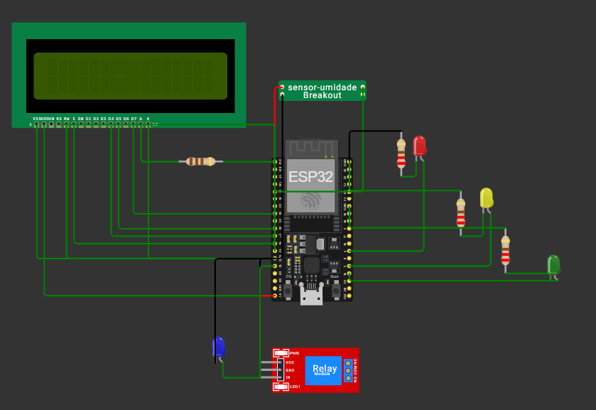

# 💧 Sistema de Irrigação Automática com Sensor de Umidade e ESP32

Este projeto simula um sistema de irrigação automática utilizando um microcontrolador ESP32, um sensor de umidade do solo, um display LCD, LEDs indicadores e um relé que aciona uma bomba de irrigação. Como o simulador **Wokwi** não possui uma bomba, utilizamos um **LED azul** para representá-la visualmente.

## 🚀 Funcionalidades

- Leitura contínua do nível de umidade do solo.
- Exibição da umidade em tempo real em um display LCD.
- Acionamento automático de uma bomba de irrigação via relay module (simulada com LED azul) quando a umidade está baixa.
- LEDs indicadores para diferentes níveis de umidade:
  - 🔴 Vermelho: Umidade muito alta.
  - 🟢 Verde: Umidade adequada.
  - 🟡 Amarelo: Umidade baixa (bomba ligada).
  - 🔵 Azul: Simula a bomba de irrigação ligada.

## 🧰 Componentes Utilizados

- ESP32
- Sensor de Umidade (analógico)
- Display LCD 16x2
- 4 LEDs: verde, amarelo, vermelho e azul (azul simula a bomba)
- Módulo Relé (simulado com LED azul)
- Jumpers e resistores (se aplicável)
- Ambiente de simulação: [Wokwi](https://wokwi.com/)

## 🔌 Ligações dos Componentes

--------------------------------------
| Componente         |   Pino ESP32   |
|--------------------|----------------|
| LCD RS             | 12             |
| LCD E              | 14             |
| LCD D4             | 27             |
| LCD D5             | 26             |
| LCD D6             | 25             |
| LCD D7             | 33             |
| Sensor de Umidade  | 34 (analógico) |
| LED Verde          | 15             |
| LED Amarelo        | 2              |
| LED Vermelho       | 4              |
| LED Azul (bomba)   | 13             |

## 🧠 Lógica de Funcionamento

- A leitura do sensor retorna um valor analógico entre 0 e 4095.
- Esse valor é mapeado para uma escala de 0 a 100% de umidade.
- O sistema então decide:
  - **≥ 60%** → Umidade alta → LED vermelho aceso, bomba (azul) desligada.
  - **20% a 59%** → Umidade ideal → LED verde aceso, bomba (azul) desligada.
  - **< 20%** → Umidade baixa → LED amarelo aceso, bomba (azul) ligada.

## 📟 Exibição no LCD

O display LCD 16x2 exibe:
- Primeira linha: o valor da umidade atual (ex: `Umidade: 45.2%`)
- Segunda linha: o status do solo (`Alta`, `Boa` ou `Baixa`)

## 🎥 Créditos

Este projeto foi desenvolvido por Laura Trigo, com base na bibliografia citada nas referências.

## 📜 Licença

Este projeto está licenciado sob a Licença MIT - veja o arquivo LICENSE para mais detalhes.

  

